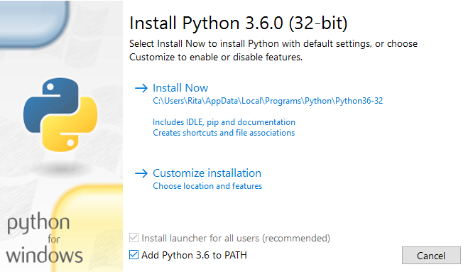
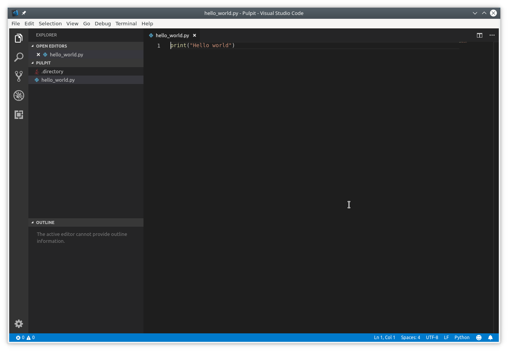

# Przygotowanie środowiska pracy

Żeby rozpocząć pracę z Pythonem potrzebujesz dwóch rzeczy:

1. Pythona
2. Edytora tekstu

Teoretycznie możesz użyć Notatnika wbudowanego w Twój system operacyjny ale z reguły jest to mało przyjemne. Na potrzeby tego kursu będziemy używać Visual Studio Code.

## Instalacja Pythona

Proces instalacji Pythona jest dość prosty, warto zwrócić uwagę na krok 3. który oszczędzi nam potem pisania.

1. Wchodzimy na https://www.python.org/downloads/ i pobieramy najnowszą wersję (w momencie pisania tego jest to 3.7.3)
2. Uruchamiamy instalator i postępujemy zgodnie z instrukcjami na ekranie.
3. WAŻNE! Zwróc uwagę czy zaznaczona jest opcja `Add Python 3.7 to PATH` jak na zrzucie ekranu

## Instalacja Visual Studio Code

Tutaj również bez większych filozofii

1. Wchodzimy na https://code.visualstudio.com/Download
2. Pobieramy instalator dla interesującego nas systemu
3. Uruchamiamy instalator i postępujemy zgodnie z instrukcjami na ekranie

## Weryfikacja czy wszystko działa

1. W dowolnym miejscu (najlepiej W `C:\Users\<nazwa użytkownika>`) tworzymy sobie katalog o naziwe np. `python`.
2. Otwieramy Visual Studio Code i otwieramy (`File -> Open folder`) tam utworzony przez nas katalog.
3. Tworzymy nowy plik klikając `New file`
4. Wpisujemy `print("Hello world")`
5. Plik zapisujemy jako `hello_world.py`

6. Otwieramy konsolę/wiersz poleceń (Windows: wciskamy Win+R, wpisujemy `cmd` oraz wciskamy Enter)
7. Wpisujemy `cd <sciezka do katalogu z kroku 1.>`, np. `cd C:\Users\mzafki\python` i wciskamy Enter
8. Wpisujemy `python hello_world.py` i wciskamy Enter.
9. Na ekranie powinniśmy zobaczyć napis `Hello world.`.
