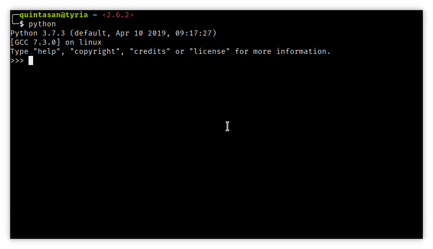
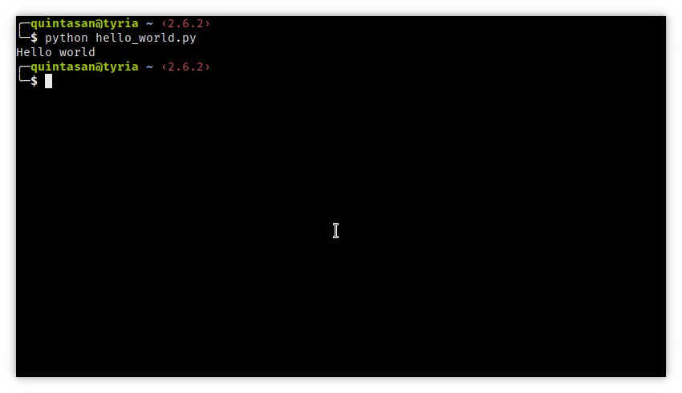

# REPL i terminal

## Wstęp

Pythona możemy uruchomić na dwa sposoby: REPL lub interpreter. REPL to interaktywna powłoka w której wpisywane polecenia są od razu wykonywane a ich wynik wyświetlany. Cały proces powtarza się dopóki nie zakończymy procesu. REPL to skrót od Read-Eval-Print-Loop.

Innym sposobem jest uruchomienie interpretera Pythona tak by wykonywał wskazany przez nas skrypt. Skrypt to nic innego jak plik tekstowy zawierający poprawny kod źródłowy w Pythonie który interpreter wykona krok po kroku.

## Uruchamianie REPL-a

Aby uruchomić REPL-a wystarczy włączyć terminal/wiersz poleceń/PowerShell i wpisać `python`. Naszym oczom powinno ukazać się mniej więcej coś takiego:

`>>>` które widzimy są znane jako znak zachęty albo prompt. Gdy je widzimy oznacza to, że możemy coś wpisać.

## Co możemy tutaj zrobić?

1. Użyć go jako kalkulatora
2. Szybko coś sprawdzić
3. Wkleić losowy kod z internetu żeby zobaczyć czy działa

## Uruchamianie skryptu

Skrypt uruchamialiśmy już podczas weryfikacji czy zainstalowane przez nas narzędzia działają. Sprowadza się to do uruchomienia terminala/wiersza poleceń/PowerShella, przejście do katalogu gdzie jest nasz plik oraz wpisanie `python <nazwa pliku>` i wciśnięcia klawisza Enter. Interpreter wykona nasz skrypt a potem zakończy pracę.

