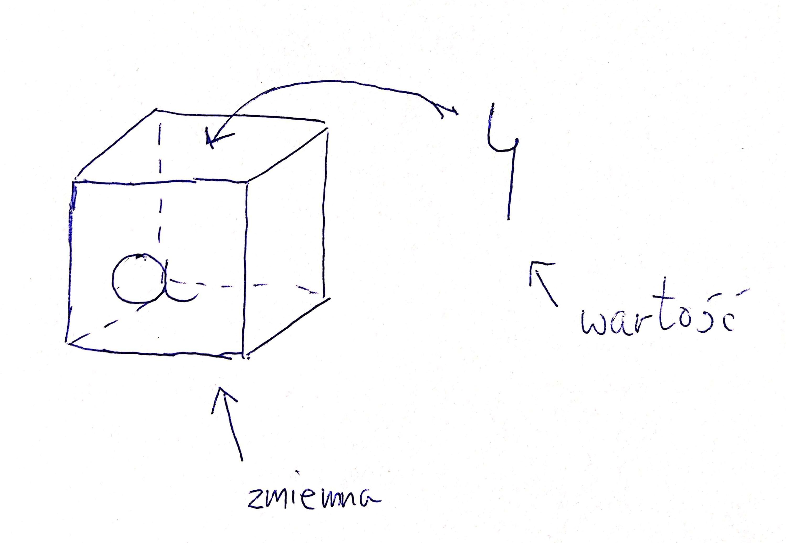

# Typy danych

Jak (prawie) każdy język programowania Python posiada typy danych. W końcu musimy jakoś móc odróżnić liczby od znaków itd.

## Zmienne

Zmienna to taki konstrukt który możecie kojarzyć z matematyki, jest to po prostu pewien indentyfikator na wartość. Jeżeli Ci to pomoże to wyobraź sobie podpisane pudełko w którym siedzi jakaś rzecz. Pudełko jest zmienną:



```python
>>> a = 1
>>> type(a)
<class 'int'>
>>> b = 1.1
>>> type(b)
<class 'float'>
```

## Typy w Pythonie

Python domyślnie zawiera zdefiniowane następujące typy danych:

* `int`
* `float`
* `str`
* `bool`
* `list`
* `tuple`
* `dict`

Jeżeli mamy jakąś zmienną i chcemy wiedzieć jakiego jest typu to możemy zrobić to przy użyciu funkcji `type()`.

### Liczby

Liczby mamy zarówno całkowite - `4` jak i zmiennoprzecinkowe - np. `4.4` (`float`).

```python
>>> type(4)
<class 'int'>
>>> type(4.4)
<class 'float'>
```

### Ciągi znaków

Częściej znane jako stringi, przechowują... ciągi znaków. Jeden widzieliśmy już na początku - `"Hello world"`.

Są dwie rzeczy, które należy pamiętać: ciągi zaczynają i kończą się one od pojedynczego lub podwójnego cudzyłowia oraz brak możliwości użycia tego samego cudzysłowia w środku ciągu.

```python
>>> "Tekst"
'Tekst'
>>> 'Tekst'
'Tekst'
>>> "RIP'
  File "<stdin>", line 1
    "RIP'
        ^
SyntaxError: EOL while scanning string literal
```

Jak widać, próba przemieszania kończy się błędem składni (`SyntaxError`).

```python
>>> 'I'm totally legitimate'
  File "<stdin>", line 1
    'I'm totally legitimate'
       ^
SyntaxError: invalid syntax
```

Jak widać, próba użycia `'` w środku naszego ciągu również kończy się `SyntaxError`em. Żeby uzyskać efekt o który nam chodziło należy zrobić to następująco:

```python
>>> "I'm a totally legitimate string"
"I'm a totally legitimate string"
>>> 'I"m a totally legitimate string'
'I"m a totally legitimate string'
>>>
```

### Typ logiczny

Do typu logicznego należą dwie wartości `True` oraz `False`. Należy pamiętać, że **muszą** zaczynać się wielką literą!

```python
>>> type(True)
<class 'bool'>
>>> type(False)
<class 'bool'>
>>> type(false)
Traceback (most recent call last):
  File "<stdin>", line 1, in <module>
NameError: name 'false' is not defined
>>> type(true)
Traceback (most recent call last):
  File "<stdin>", line 1, in <module>
NameError: name 'true' is not defined
```

### Listy

Listy to... listy rzeczy. Listę zaczynamy i kończymy nawiasem kwadratowym a elementy oddzielamy przecinkami.

```python
>>> [1,2,3]
[1, 2, 3]
>>> type([1, "a", 3.3, 4])
<class 'list'>
```

Do elementów listy możemy się odwoływać również indeksami. Warto pamiętać, że informatycy są trochę dziwni i liczą od zera.

```python
>>> lista = [1,2,3,4]
>>> lista[0]
1
>>> lista[3]
4
>>> lista[-4]
???
```

### Krotki

Krotki, czasami zwane tuplami są bardzo podobne do list. Odróżnia je fakt, że są niemutowalne (niezmienne). Krotkę zaczynamy i kończymy zwykłymi nawiasami a jej elementy oddzielamy przecinkami.

```python
>>> (1,2,3)
(1, 2, 3)
>>> type((1, 'a', 3.4))
<class 'tuple'>
```

Podobnie jak w przypadku listy, do elementów kroki możemy odnosić się indeksami

```python
>>> krotka = (1,2,3)
>>> krotka[0]
1
>>> krotka[2]
3
```

### Słowniki

Czasami znane jako tablica haszująca, tablica asocjacyjna czy mapa. Generalnie mają postać `klucz: wartość` przy czym klucz **musi** być unikatowy w obrębie słownika.

```python
>>> slownik = { "Polska": "Warszawa", "Niemcy": "Berlin", "Fracja": "Paryż" }
{'Polska': 'Warszawa', 'Niemcy': 'Berlin', 'Fracja': 'Paryż'}
>>> type(slownik)
<class 'dict'>
```

Słownik **nie** ma kolejności. Zatem próba odwołania się do jego zerowego elementu będzie równoznaczna z próbą dostania się do wartości znajdującej się pod kluczem `0`.

```python
>>> d = { "Polska": "Warszawa", "Niemcy": "Berlin", "Fracja": "Paryż" }
>>> d[0]
Traceback (most recent call last):
  File "<stdin>", line 1, in <module>
KeyError: 0
```

Należy pamiętać, że przypisanie wartości do **nieistniejącego** klucz jest równoznaczne z powiększeniem słownika:

```python
>>> d = { "Polska": "Warszawa", "Niemcy": "Berlin", "Fracja": "Paryż" }
>>> d[0]
Traceback (most recent call last):
  File "<stdin>", line 1, in <module>
KeyError: 0
>>> d["c"] = 1
>>> d["c"]
1
```
